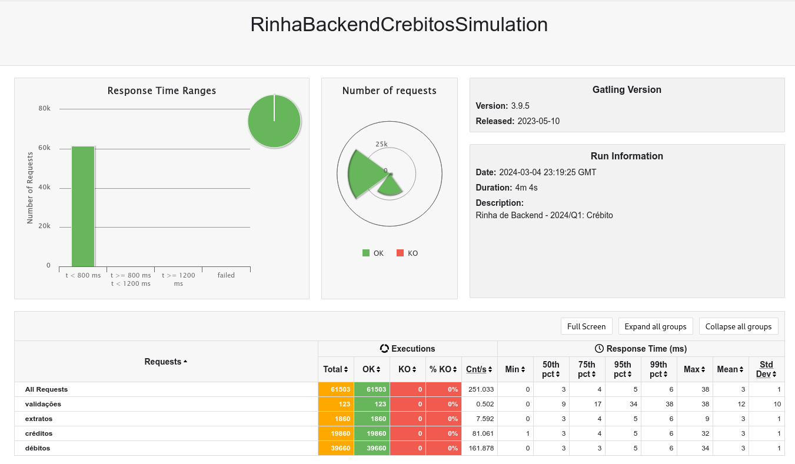
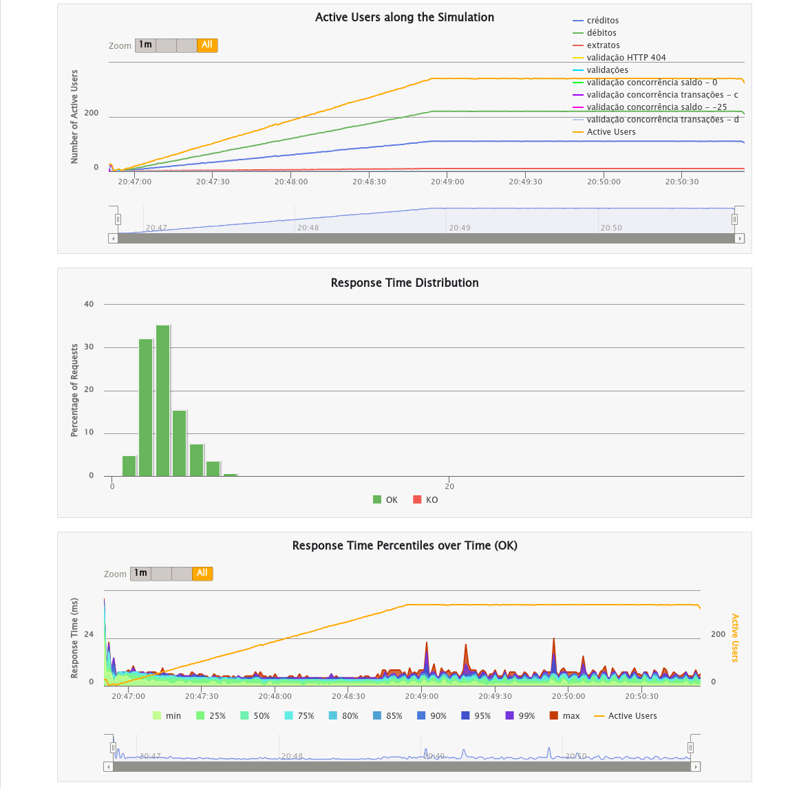

# Rinha de Backend

Este pequeno projeto foi inspirado pelo desafio proposto na [Rinha de Backend 2024 Q1](https://github.com/zanfranceschi/rinha-de-backend-2024-q1).

Em resumo, o objetivo é implementar uma API simples, capaz de sobreviver a um teste de estresse usando pouquíssimos recursos.

## Tech Stack

- [Postgres](https://www.postgresql.org/)
- [Nginx](https://www.nginx.com/)
- [Drogon](https://drogon.org/)
- C++

## Execução da Aplicação

Desenvolvemos nossa solução com gerenciamento e execução de contêineres realizado através do *podman* e do *podman-compose*.

```bash
$ podman-compose --version
podman-compose version: 1.0.6
['podman', '--version', '']
using podman version: 4.9.0
podman-compose version 1.0.6
podman --version 
podman version 4.9.0
exit code: 0
```

A aplicação completa (incluindo todos os componentes) pode ser iniciada da seguinte forma:

```bash
$ podman-compose -f docker-compose.yml up --build
```

Para terminar a execução:

```bash
$ podman-compose -f docker-compose.yml down
```

## Execução dos Testes de Carga

Temos nesse repositório uma cópia dos [testes de carga originais](https://github.com/zanfranceschi/rinha-de-backend-2024-q1/tree/main/load-test) para facilitar o trabalho de desenvolvimento.

Para executar os testes, o primeiro passo é "levantar" a aplicação.

Em seguida instalar o `gatling`, caso o mesmo não esteja disponível. A variável `INSTALL_DIR` pode ser customizada. O valor padrão é `$HOME/bin`.

```bash
$ cd stress_test
$ ./install_gatling.sh
```

Em seguida execute os testes.  A variável `GATLING_HOME` no script pode ser customizada para apontar para a instalação do  `gatling`.  O valor padrão é `$HOME/bin/gatling-3.9.5/`.

```bash
$ cd stress_test
$ ./executar-teste-local.sh
```

## Meus Resultados

Testes executados em um laptop Dell XPS13 9320 (2023), [specs](#especificações-do-ambiente-de-testes) abaixo.





### Especificações do Ambiente de Testes

Fedora Linux
```
$ neofetch 
             .',;::::;,'.                fabiano@novavita 
         .';:cccccccccccc:;,.            ---------------- 
      .;cccccccccccccccccccccc;.         OS: Fedora Linux 39 (Workstation Edition) x86_64 
    .:cccccccccccccccccccccccccc:.       Host: XPS 9320 
  .;ccccccccccccc;.:dddl:.;ccccccc;.     Kernel: 6.7.5-200.fc39.x86_64 
 .:ccccccccccccc;OWMKOOXMWd;ccccccc:.    Uptime: 1 day, 2 hours, 35 mins 
.:ccccccccccccc;KMMc;cc;xMMc:ccccccc:.   Packages: 2399 (rpm), 8 (flatpak) 
,cccccccccccccc;MMM.;cc;;WW::cccccccc,   Shell: bash 5.2.26 
:cccccccccccccc;MMM.;cccccccccccccccc:   Resolution: 3440x1440 
:ccccccc;oxOOOo;MMM0OOk.;cccccccccccc:   DE: GNOME 45.4 
cccccc:0MMKxdd:;MMMkddc.;cccccccccccc;   WM: Mutter 
ccccc:XM0';cccc;MMM.;cccccccccccccccc'   WM Theme: Adwaita 
ccccc;MMo;ccccc;MMW.;ccccccccccccccc;    Theme: Adwaita [GTK2/3] 
ccccc;0MNc.ccc.xMMd:ccccccccccccccc;     Icons: Adwaita [GTK2/3] 
cccccc;dNMWXXXWM0::cccccccccccccc:,      Terminal: gnome-terminal 
cccccccc;.:odl:.;cccccccccccccc:,.       CPU: 13th Gen Intel i7-1360P (12) @ 5.000GHz 
:cccccccccccccccccccccccccccc:'.         GPU: Intel Raptor Lake-P [Iris Xe Graphics] 
.:cccccccccccccccccccccc:;,..            Memory: 6116MiB / 31701MiB 
  '::cccccccccccccc::;,.
                                                                 
```

Podman
``` 
$ podman-compose --version
podman-compose version: 1.0.6
['podman', '--version', '']
using podman version: 4.9.0
podman-compose version 1.0.6
podman --version 
podman version 4.9.0
exit code: 0
```

Gatling / Java
```
# gatling versão 3.9.5
$ java --version
openjdk 17.0.9 2023-10-17
OpenJDK Runtime Environment (Red_Hat-17.0.9.0.9-4) (build 17.0.9+9)
OpenJDK 64-Bit Server VM (Red_Hat-17.0.9.0.9-4) (build 17.0.9+9, mixed mode, sharing)
```
