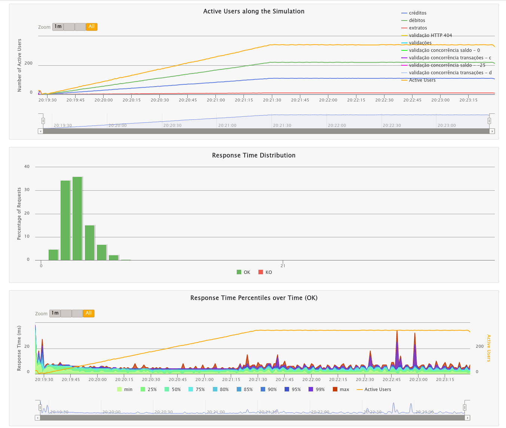

# Rinha de Backend

Este pequeno projeto foi inspirado pelo desafio proposto na [Rinha de Backend 2024 Q1](https://github.com/zanfranceschi/rinha-de-backend-2024-q1).

Em resumo, o objetivo é implementar uma API simples, capaz de sobreviver a um teste de estresse usando pouquíssimos recursos.

## Tech Stack

- [Postgres](https://www.postgresql.org/)
- [Nginx](https://www.nginx.com/)
- [Drogon](https://drogon.org/)
- C++

## Execução da Aplicação

Desenvolvemos nossa solução com gerenciamento e execução de contêineres realizado através do *podman* e do *podman-compose*.

```bash
$ podman-compose --version
podman-compose version: 1.0.6
['podman', '--version', '']
using podman version: 4.9.0
podman-compose version 1.0.6
podman --version 
podman version 4.9.0
exit code: 0
```

A aplicação completa (incluindo todos os componentes) pode ser iniciada da seguinte forma:

```bash
$ podman-compose -f docker-compose.yml up --build
```

Para terminar a execução:

```bash
$ podman-compose -f docker-compose.yml down
```

## Execução dos Testes de Carga

Temos nesse repositório uma cópia dos [testes de carga originais](https://github.com/zanfranceschi/rinha-de-backend-2024-q1/tree/main/load-test) para facilitar o trabalho de desenvolvimento.

Para executar os testes, o primeiro passo é "levantar" a aplicação.

Em seguida instalar o `gatling`, caso o mesmo não esteja disponível. A variável `INSTALL_DIR` pode ser customizada. O valor padrão é `$HOME/bin`.

```bash
$ cd stress_test
$ ./install_gatling.sh
```

Em seguida execute os testes.  A variável `GATLING_HOME` no script pode ser customizada para apontar para a instalação do  `gatling`.  O valor padrão é `$HOME/bin/gatling-3.9.5/`.

```bash
$ cd stress_test
$ ./executar-teste-local.sh
```



